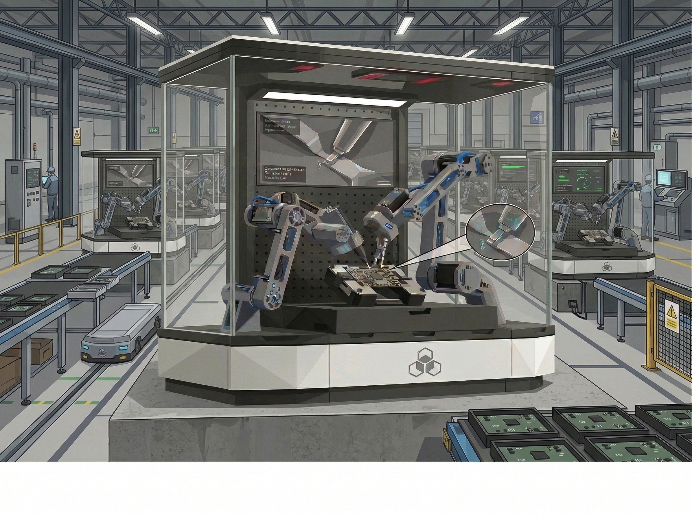
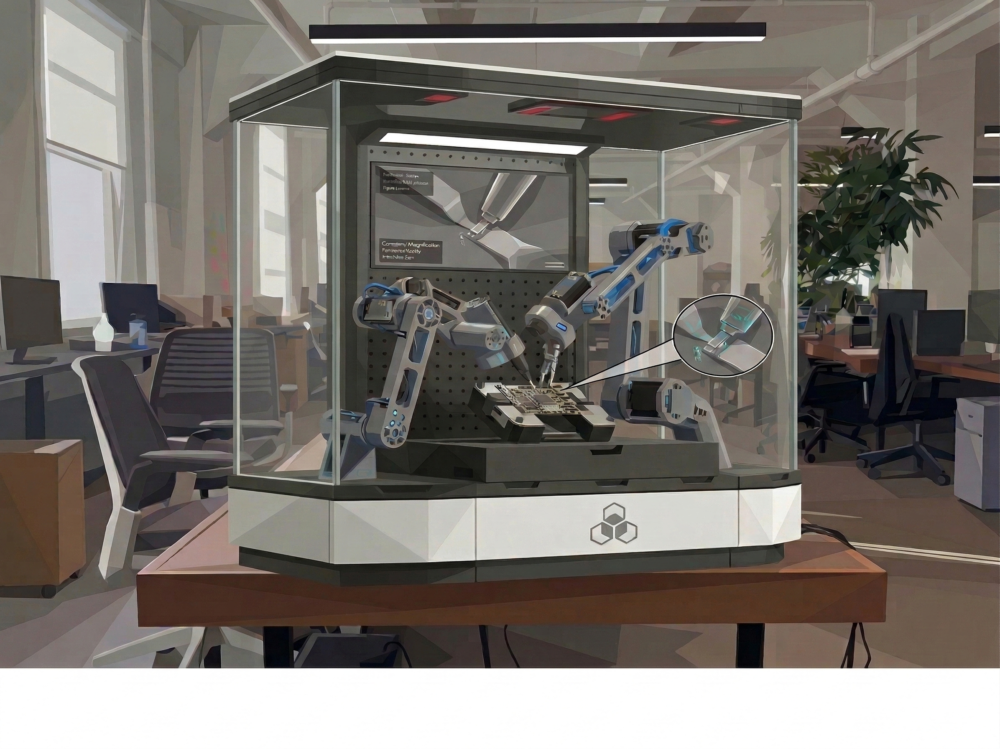

# 🏭 open-microfactory

**Open-source dexterous assembly cell deployable on a desktop, a workshop bench, or a factory floor. Bimanual SO-ARM101 · Da Vinci-inspired teleoperation · VLA-driven autonomy · Twin demonstration cell. In development.**

[](LICENSE)
[]()
[]()
[]()
[]()

---

> *A microfactory is not a scaled-down factory — it is a rethinking of manufacturing at the cell level: flexible, intelligent, and accessible. One cell, one bench, one person. Any assembly. Made for micro-startups*

---

## Overview

**open-microfactory** is an open-source robotic assembly cell designed to perform dexterous manipulation tasks — PCB population, connector insertion, small-part assembly, packaging, food preparation— at a cost and footprint accessible to independent developers, small businesses, and research labs, while remaining scalable to industrial deployment in larger facilities. Software automation scales for free. Physical automation is gated by hardware. We make the full stack accessible — Physical AI for micro-startups, not the factory.

<div align="center">
  
  <br><em>Factory deployment — enclosed cell with bimanual arms, conveyor integration, and operator monitoring station.</em>
</div>

<br/>

<div align="center">
  
  <br><em>Desktop deployment — same cell hardware on a workbench, suitable for home-based small-batch production.</em>
</div>

---
The cell is built around a **bimanual [SO-ARM101](https://github.com/TheRobotStudio/SO-ARM100)** arrangement enclosed in a transparent workspace frame. It is taught new assembly tasks via a **twin demonstration cell** — a mirrored human workspace equipped with a Da Vinci-inspired teleoperation leader system and hand-tracking input devices — and autonomized through **[LeRobot](https://github.com/huggingface/lerobot)** imitation learning and **VLA policies** ([open-poporo-vla](https://github.com/gigalgi/open-poporo-vla), [neurosymbolic-vla](https://github.com/gigalgi/neurosymbolic-vla)).

From the perspective of this architecture, **food preparation is assembly**. Building a hot dog — bun placement, sausage insertion, condiment dispense — is structurally identical to connector insertion and snap-fit assembly: a sequence of pick, orient, place, and apply-force primitives operating on compliant, geometrically variable objects. Building a pizza — dough handling, sauce spreading, topping distribution — introduces deformable object manipulation and continuous force control, which are among the hardest open problems in dexterous robotics. The microfactory cell treats both the electronics workbench and the food prep counter as valid assembly environments, and the same skill cartridges, demonstration pipeline, and VLA policies apply across both domains without architectural changes.

| Assembly Domain | Representative Tasks | Key Manipulation Challenges |
|---|---|---|
| **Electronics** | PCB population, connector insertion, screw driving | Precision peg-in-hole, sub-mm repeatability |
| **Furniture** | IKEA peg-and-dowel, cam lock, snap-fit | Multi-step bimanual coordination, force compliance |
| **Food — dry** | Hot dog assembly, sandwich stacking, wrap folding | Rigid + semi-rigid object sequencing, condiment dispensing |
| **Food — deformable** | Pizza dough spreading, topping placement, dough folding | Deformable object manipulation, continuous force control |
| **Packaging** | Box folding, label application, sealing | High-speed repetitive motion, surface contact control |

The design philosophy has three non-negotiable constraints:
- **Replicable:** IKEA structural components, 3D-printed brackets, Amazon-available sensors. No custom machined parts required to build the first cell.
- **Teachable:** Any assembly sequence can be demonstrated by a human operator and transferred to the robot within a single session.
- **Scalable:** The same cell hardware and software stack deploys identically on a home bench or inside a production facility.

---

## Cell Architecture

### 1. Robot Side — Bimanual SO-ARM101

The primary manipulation platform is a **dual SO-ARM101** arrangement — two 6-DOF follower arms mounted symmetrically on a shared base plate, with coordinated action spaces defined for bimanual grasping, handoff, and insertion. The arms are enclosed in a transparent acrylic/polycarbonate safety frame with integrated overhead lighting and a downward-facing camera array for visual observation.

Key assembly target for initial validation: **IKEA flat-pack furniture sub-assemblies** — standardized, widely available, geometrically varied, and representative of the peg-in-hole, screw-driving, and snap-fit operations encountered in real light manufacturing.

---

### 2. Human Side — Twin Demonstration Cell

The twin cell is a mirrored physical workspace where a human operator performs the target assembly while the system records a complete multimodal demonstration dataset. It is the primary data source for all imitation learning and VLA fine-tuning pipelines.

**Teleoperation input — Da Vinci-inspired leader system:**

Inspired by the kinematic decoupling architecture of the da Vinci Surgical System, the leader arm separates the operator's gross wrist motion from fine fingertip articulation. The modified SO-ARM101 teleoperation arm captures 6-DOF wrist pose; fine manipulation intent is captured separately via:

- **[Leap Motion Controller](https://www.ultraleap.com/)** — sub-millimeter hand skeleton tracking, no glove required, captures individual finger joint angles at 200 Hz.
- **Oculus / Meta Quest hand tracking** — full hand pose in 3D space with controller-free mode, enables natural bimanual demonstration without physical leader arms for gross-motion tasks.

The two input modalities are fused: Leap Motion provides high-precision finger articulation; Quest provides workspace-scale wrist and arm positioning. The fusion layer maps the combined signal onto the follower arm joint space in real time.

---

### 3. End Effector — 3-Finger Dexterous Hand

The default SO-ARM101 gripper is replaced with a custom **3-finger dexterous hand** developed in [open-yta-hand](https://github.com/gigalgi/open-yta-hand):

| Feature | Description |
|---|---|
| Fingers | 3 — index, middle, opposable thumb |
| Thumb range | 180° abduction — hand is geometrically left or right simultaneously |
| Grasp modes | Precision pinch · Power wrap · Lateral key · Tripod |
| Sensing | [open-huca-skin](https://github.com/gigalgi/open-huca-skin) tactile patches on fingerpads — contact force + slip detection |
| Actuation | Low-profile servo per joint, CAN bus or PWM |
| Fabrication | 3D printed structural parts + off-the-shelf servo hardware |

The 180° opposable thumb removes the distinction between left-hand and right-hand configurations — one end-effector design mounts on either arm without mechanical modification, halving the number of unique parts in the cell.

---

### 4. Software Stack

#### Demonstration & Data Collection
- **LeRobot** — real-time teleoperation recording, dataset management, and policy training pipeline. All demonstrations saved in LeRobot HDF5 format for direct compatibility with the broader HuggingFace robotics ecosystem.
- **Custom fusion layer** — merges Leap Motion finger data with arm joint telemetry into a unified observation-action stream.
- **Multi-camera observation** — overhead stereo pair + wrist-mounted wide-angle camera per arm. Synchronized with joint state at 50 Hz.

#### Autonomy
- **[open-poporo-vla](https://github.com/gigalgi/open-poporo-vla)** — biologically-grounded VLA (V-JEPA 2 + DGMoE + LoRAC + Residual RL) for continual skill acquisition and compositional task execution. Primary autonomy stack for novel assembly variants.
- **[neurosymbolic-vla](https://github.com/gigalgi/neurosymbolic-vla)** — symbolic VLA (OSKR + GraSP) for long-horizon task decomposition and replanning on anomaly detection. Handles structured assembly sequences with explicit sub-goal tracking.

#### Simulation
- **Isaac Lab** — physics simulation for generating synthetic training data, validating new assembly tasks before hardware deployment, and training the Whole-Body Controller for the open-kumanday-humanoid deployment target.

---

### 5. Cell Frame — IKEA + 3D Print Construction

The enclosure is assembled from standard IKEA KALLAX / LACK / SKÅDIS shelf components as the primary structural skeleton, supplemented by 3D-printed mounting brackets, camera rails, and arm base plates. All custom printed parts are designed for FDM printing on a standard 220×220 mm bed with no support structures required.

| Component | Source |
|---|---|
| Frame skeleton | IKEA KALLAX / LACK shelving |
| Enclosure panels | 4 mm clear acrylic sheet (Amazon / local hardware) |
| Arm base plate | 3D printed — PETG or ASA |
| Camera mounts | 3D printed — PLA |
| Lighting | LED strip + diffuser (Amazon) |
| Emergency stop | 22 mm panel-mount mushroom button (Amazon) |

The complete Bill of Materials targets a cell hardware cost under **$2,000 USD** (excluding the SO-ARM101 arms) for the first build.

---

## System Architecture

```
 Human Operator
        │
        ├─── Leap Motion (finger articulation, 200 Hz)
        ├─── Quest hand tracking (wrist + arm pose)
        └─── Modified SO-ARM101 leader arms
                        │
                        ▼
 ┌──────────────────────────────────────────────────────────────────┐
 │              TWIN DEMONSTRATION CELL                             │
 │   Teleoperation fusion layer → unified observation-action stream │
 │   LeRobot recording pipeline → HDF5 demonstration dataset       │
 └──────────────────────────────┬───────────────────────────────────┘
                                │  demonstrations
                                ▼
 ┌──────────────────────────────────────────────────────────────────┐
 │              POLICY TRAINING                                     │
 │   LeRobot ACT / Diffusion Policy  ← imitation learning          │
 │   open-poporo-vla LoRAC cartridge ← skill fine-tuning           │
 │   neurosymbolic-vla OSKR graph    ← task decomposition          │
 └──────────────────────────────┬───────────────────────────────────┘
                                │  trained policy
                                ▼
 ┌──────────────────────────────────────────────────────────────────┐
 │              ROBOT CELL — ASSEMBLY EXECUTION                     │
 │                                                                  │
 │   Overhead stereo cameras + wrist cameras                        │
 │   → open-poporo-vla perception + action inference                │
 │   → neurosymbolic-vla sub-goal dispatch                         │
 │                                                                  │
 │   ┌───────────────────┐     ┌───────────────────┐               │
 │   │  SO-ARM101 LEFT   │     │  SO-ARM101 RIGHT  │               │
 │   │  3-finger hand    │     │  3-finger hand    │               │
 │   │  huca-skin pads   │     │  huca-skin pads   │               │
 │   └────────┬──────────┘     └──────────┬────────┘               │
 │            └──────────┬────────────────┘                        │
 │                       ▼                                         │
 │              Bimanual action space                               │
 │              Assembly workspace (IKEA frame)                    │
 └──────────────────────────────────────────────────────────────────┘
```

---

## Roadmap

### Phase 0 — Hardware Development *(Current focus)*
| Component | Status |
|---|---|
| Unit cell design | 🚧 In progress |
| Da Vinci-inspired leader arms | 🚧 In progress |
| Leap Motion / Quest hand tracking integration | 🚧 In progress |
| 3-finger dexterous hand — 180° opposable thumb | 🚧 In progress |
| open-huca-skin tactile feedback on fingerpads | 🚧 In progress |
| BOM | 🚧 In progress |
| STEP files for manufacturing | 🚧 In progress |
| Assembly guide | 🚧 In progress |
| MuJoCo XML model | 🚧 In progress |
| URDF for Isaac Lab | 🚧 In progress |

### Phase 1 — Control & Teleoperate
| Component | Status |
|---|---|
| ROS2 Humble + MoveIt2 | ⏳ Planned |
| LeRobot bimanual integration | ⏳ Planned |
| Teleoperation pipeline — leader arms + hand tracking → follower arms | ⏳ Planned |
| First bimanual demonstration dataset (IKEA assembly) | ⏳ Planned |
| MuJoCo trainning and testing| 🚧 In progress |
| Isaac-sim/lab trainning and testing | 🚧 In progress |
| MuJoCo-Isaac-sim cross policy validation | 🚧 In progress |

### Phase 2 — Learn & Automate
| Component | Status |
|---|---|
| VLAs / Diffusion Policy — first closed-loop autonomous assembly | 🚧 In progress |
| First food task: hot dog assembly | 🚧 In progress |
| open-poporo-vla skill cartridges for continual task addition | 🚧 In progress |
| Deformable food task: pizza assembly | ⏳ Planned |

---

## Related Repositories

| Repository | Role in microfactory |
|---|---|
| [SO-ARM101](https://github.com/TheRobotStudio/SO-ARM100) | Primary follower and leader arms — bimanual cell backbone |
| [open-poporo-vla](https://github.com/gigalgi/open-poporo-vla) | Continual skill learning VLA — autonomy for novel assembly variants |
| [neurosymbolic-vla](https://github.com/gigalgi/neurosymbolic-vla) | Symbolic task decomposition and long-horizon replanning |
| [open-yta-hand](https://github.com/gigalgi/open-yta-hand) | 3-finger dexterous end effector with 180° thumb |
| [open-huca-skin](https://github.com/gigalgi/open-huca-skin) | Tactile skin patches — contact force and slip detection on fingerpads |
| [open-pquaca-arm](https://github.com/gigalgi/open-pquaca-arm) | 5-DOF arm — single-arm testbed for cell primitives |
| [open-kumanday-humanoid](https://github.com/gigalgi/open-kumanday-humanoid) | Long-term humanoid deployment target as cell operator |

---

## References

[1] T. Zhao *et al.*, "Learning Fine-Grained Bimanual Manipulation with Low-Cost Hardware," in *Proc. Robotics: Science and Systems (RSS)*, 2023.

[2] H. Cadene *et al.*, "LeRobot: Making Robotics More Accessible with PyTorch," HuggingFace, 2024. [Online]. Available: https://github.com/huggingface/lerobot

[3] H. Cadene *et al.*, "SmolVLA: A Vision-Language-Action Model for Affordable and Efficient Robotics," *arXiv preprint arXiv:2506.01844*, 2025.

[4] NVIDIA, "Building Generalist Humanoid Capabilities with NVIDIA Isaac GR00T N1.6," NVIDIA Developer Blog, 2025.

[5] Sunrise Robotics, "Microfactory Cell," 2024. [Online]. Available: https://sunriserobotics.co/

[6] Microfactory Robot, LinkedIn Company Page. [Online]. Available: https://www.linkedin.com/company/microfactory-robot/about/

[7] Intuitive Surgical, "da Vinci Surgical System — kinematic architecture," 2023. [Online]. Available: https://www.intuitive.com/

[8] Ultraleap, "Leap Motion Controller 2," 2023. [Online]. Available: https://www.ultraleap.com/

[9] G. Galvis Giraldo, "Monolithic Robotics with Cognitive AI: A Compliant Mechanism-Based Anthropomorphic Arm Design for Semantic Autonomous Manipulation," M.S. thesis, Sungkyunkwan University, 2024.

---

## Author

**Gilberto Galvis Giraldo**
M.Sc. Electrical and Computer Engineering — Sungkyunkwan University

---

## License

Apache License, Version 2.0 — see [LICENSE](LICENSE) for details.
